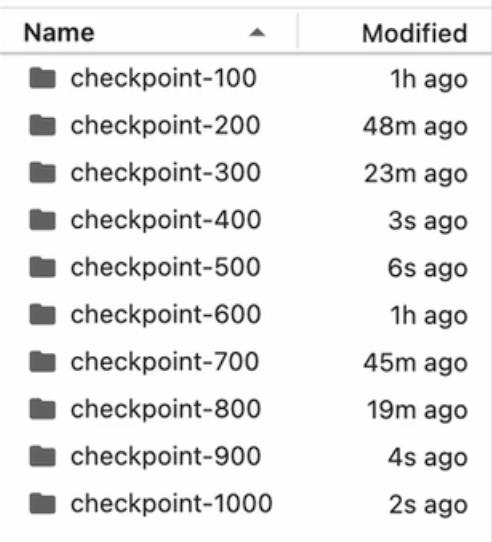

# GRPO 训练实验记录

## 实验概述

本文档记录了使用生成式提示与输出强化学习（GRPO, Generative Reinforcement from Prompts and Outputs）在GSM8K（小学数学）数据集上训练语言模型的关键组件和步骤。

## 关键组件

### 模型架构
- **基础模型**：Qwen/Qwen2.5-0.5B-Instruct
- **训练方法**：GRPO（生成式提示与输出强化学习）
- **硬件**：支持CUDA的GPU

### 数据集
- **数据集**：GSM8K（小学数学）
- **格式**：带有推理步骤和最终答案的问题
- **系统提示词**：Respond in the following format: < reasoning > ... </ reasoning > < answer > ... </ answer >

### 奖励函数
1. **xmlcount_reward_func**：奖励正确的XML标签格式
2. **soft_format_reward_func**：奖励维持特定格式（宽松版）
3. **strict_format_reward_func**：奖励维持特定严格格式
4. **int_reward_func**：奖励生成数值型回应
5. **correctness_reward_func**：奖励正确答案

### 训练配置
- **学习率**：5e-6
- **批量大小**：每设备1个
- **梯度累积步骤**：4
- **生成数量**：16
- **最大提示长度**：256
- **最大完成长度**：200
- **训练轮次**：1
- **保存步骤**：100
- **权重衰减**：0.1
- **预热比例**：0.1
- **最大梯度范数**：0.1

## 实验步骤

### 1. 环境设置
- 导入所需库：torch, datasets, transformers, trl
- 配置系统提示和XML格式要求

### 2. 数据集准备
- 加载GSM8K数据集
- 将问题和答案处理成所需格式
- 使用正则表达式提取答案模式

### 3. 奖励函数实现
- 定义格式正确性和回答正确性的奖励函数
- 实现XML标签检测和验证
- 创建基于提取答案的正确性评估

### 4. 模型配置
- 设置GRPO配置参数
- 使用bfloat16精度初始化模型
- 配置带有适当填充标记的分词器

### 5. 训练过程
- 使用模型、分词器和奖励函数创建GRPO训练器
- 训练指定轮次的模型
- 定期保存检查点

### 6. 模型评估
- 加载保存的模型检查点
- 实现带文本流的推理函数
- 测试模型在样例问题上的表现

## 结果

模型训练成功，每100步保存一次检查点。最终模型检查点保存在第900步。

样例模型输出显示了生成格式正确的推理步骤和答案的能力。训练成功地教导模型：
1. 使用正确的XML标签格式化推理和答案
2. 遵循结构化的推理步骤
3. 生成数学问题的数值答案

## 缺陷以及下一步工作

1. 在实际训练时候，基本上前300个checkpoint都是无效的，所以说r1的冷处理还是比较必要的。
2. 这个一个比较小的基础模型下，也能通过训练得到比较好的效果，只凭借单个模型，那么投入几十万倍的数据训练和投入的话，效果肯定会更好。